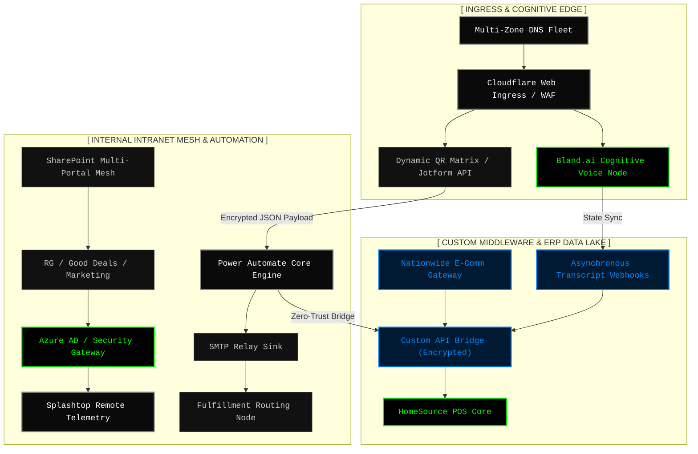

<div align="center">
  <h1 style="color: #00ff00; font-family: monospace;">[ RG-CORE ECHELON MATRIX ]</h1>
  <h3 style="font-family: monospace; color: #888888;">SYSTEM ARCHITECTURE & TELEMETRY INDEX</h3>
  <p style="font-family: monospace;"><b>STATUS: SECURE | ROUTING: NOMINAL | ENCRYPTION: AES-256</b></p>
  <hr>
</div>

```text
========================================================================================
██████╗  ██████╗       ██████╗ ██████╗ ██████╗ ███████╗
██╔══██╗██╔════╝      ██╔════╝██╔═══██╗██╔══██╗██╔════╝
██████╔╝██║  ███╗█████╗██║     ██║   ██║██████╔╝█████╗  
██╔══██╗██║   ██║╚════╝██║     ██║   ██║██╔══██╗██╔══╝  
██║  ██║╚██████╔╝      ╚██████╗╚██████╔╝██║  ██║███████╗
╚═╝  ╚═╝ ╚═════╝        ╚═════╝ ╚═════╝ ╚═╝  ╚═╝╚══════╝
[INTEGRITY CHECK] ............................... [PASS]
[EDGE ROUTING] .................................. [ACTIVE]
[ACCESS CONTROL] ................................ [STRICT]
========================================================================================

0x0000  45 00 00 3c 1c 46 40 00 40 06 b1 e6 c0 a8 00 68  E..<.[email protected].@......h
0x0010  c0 a8 00 01 04 00 00 50 00 00 00 00 00 00 00 00  .......P........
0x0020  a1 b2 c3 d4 e5 f6 07 18 29 3a 4b 5c 6d 7e 8f 90  [ENCRYPTED_BLOB]
```


