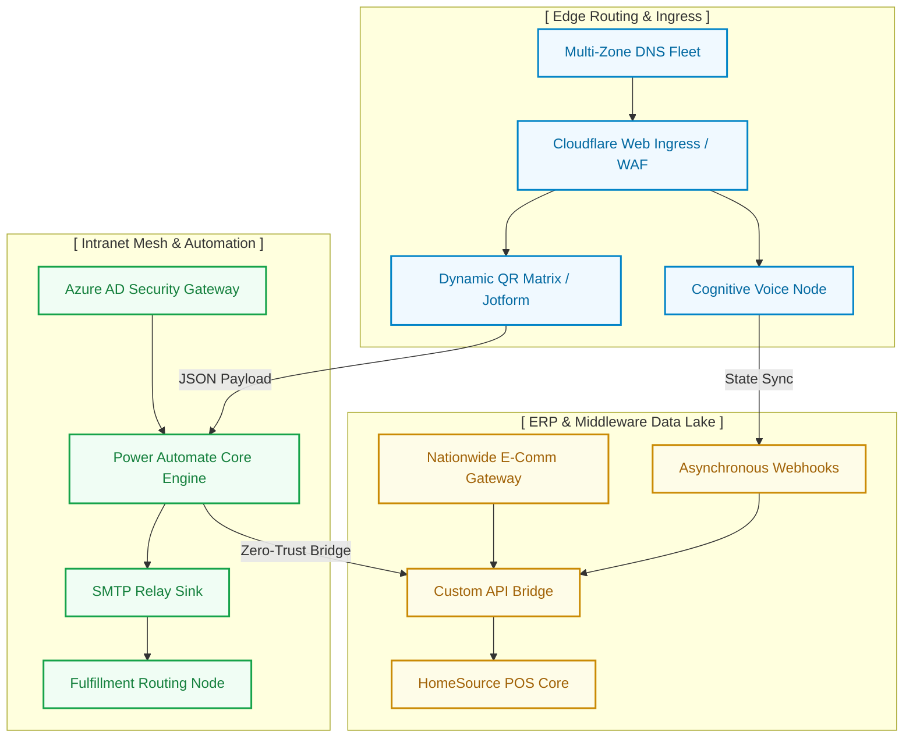

  
  
  <h2>IT Infrastructure & Automation Core</h2>
  
<b>Centralized repository for digital routing, e-commerce middleware, and zero-trust mesh architecture.</b>

  
  
  
  
  

## 🏗️ System Topology

Our infrastructure operates on a tightly integrated multi-tenant mesh, routing cognitive edge processing directly into our ERP data lakes.

## 📖 Directory Index

* **`/assets`** — Approved branding and static UI components.
* **`/automations`** — Power Automate workflow templates and JSON configurations.
* **`/web`** — E-commerce UI components and Jotform portal configurations.
