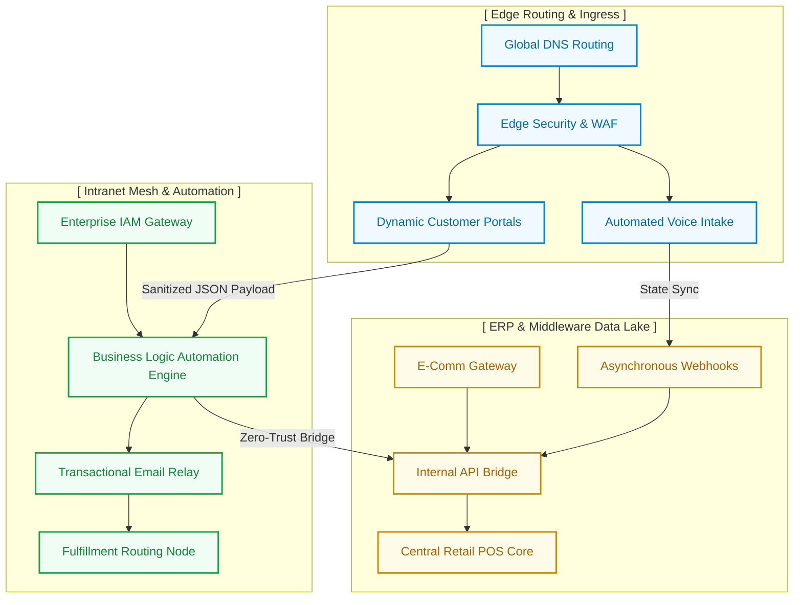

  
  
  <h2>IT Infrastructure & Automation Overview</h2>
  
<b>High-level architectural topology for enterprise digital routing, e-commerce middleware, and zero-trust mesh.</b>

  
  
  
  

## 🏗️ System Topology

This diagram provides a sanitized, high-level overview of our multi-tenant mesh, demonstrating how edge processing securely integrates with our core data lakes.

## 📖 Directory Index

* **`/assets`** — Approved branding and static UI components.
* **`/automations`** — Workflow logic templates and configurations.
* **`/web`** — E-commerce UI components and portal configurations.
